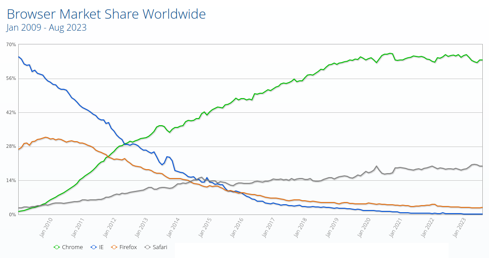

# Pourquoi utiliser Firefox comme navigateur principal

plutôt que Google Chrome (ou autre)

– Politique – Éthique –

---

## Politique – Éthique

**Politique :**
relatif à l'organisation d'un état, à l'exercice du pouvoir dans une société organisée

<!-- .element: class="fragment" -->

**Éthique :**
partie de la philosophie qui envisage les fondements de la morale,
ensemble des principes moraux qui sont à la base de la conduite de quelqu'un

<!-- .element: class="fragment" -->

---

## Préambule

Pas une condamnation en bloc de Google

Google acteur dangereux, mais …
<!-- .element: class="fragment" -->

jusqu'à présent globalement Google fait du bien à internet/informatique
<!-- .element: class="fragment" -->

(ce qui n'est globalement pas du tout le cas de Microsoft par exemple)
<!-- .element: class="fragment" -->

Pas l'objectif de ne plus jamais utiliser Chrome
<!-- .element: class="fragment" -->

🦊 Objectif d'utiliser principalement Firefox 🦊

<!-- .element: class="fragment" -->

----

### Les nombreux méfaits de Microsoft

à suivre …

---

## Google Chrome

* 2008 : sortie de la première version du navigateur web *Google Chrome*

<!-- .element: class="fragment" -->

* 2012 : Chrome navigateur web le plus utilisé dans le monde

<!-- .element: class="fragment" -->

* Depuis 2016 : Chrome en position dominante

<!-- .element: class="fragment" -->

[Statistiques StatCounter](https://gs.statcounter.com/)

<!-- .element: class="fragment" -->

---

## Concentration supplémentaire avec Microsoft Edge

* 2020 : *Microsoft Edge*, le navigateur de Microsoft, renforce la position de Chrome

<!-- .element: class="fragment" -->

  

    

  

Microsoft Edge = moteur de rendu *Blink* de Chrome + *V8* moteur JavaScript de Chrome

Microsoft Edge ~ Google Chrome
<!-- .element: class="fragment" -->

<!-- .element: class="fragment" -->

---

## Google Chrome, quasi monopole

Utilisation de Chrome ultramajoritaire dans le monde
<!-- .element: class="fragment" -->

Position de quasi monopole au niveau des navigateurs et l'élaboration des standards web
<!-- .element: class="fragment" -->

Il y a donc maintenant une …
<!-- .element: class="fragment" -->

---

## Monoculture dirigée par Google

Google peut définir sans se soucier d'autres intérêts ce qui peut se faire ou non sur internet
<!-- .element: class="fragment" -->

(la manière dont les sites web et les services en ligne peuvent se comporter)

<!-- .element: class="fragment" -->

… sans se soucier de l'intérêt des utilisateurs 🧑👋 :
<!-- .element: class="fragment" -->

* l'affaire de la barre d'adresse
* l'affaire des extensions web
* l'affaire du compte Google connecté par défaut
* les vraiment très nombreux projets [<q>Killed by Google</q>](https://killedbygoogle.com/)
* etc.

<!-- .element: class="fragment" -->

----

« Si à un moment Chrome m'empêche de faire ça, je pourrai bien changer de navigateur ! » 🤡

→ Mais il sera trop tard, la monoculture aura produit ses effets 😭
<!-- .element: class="fragment" -->

Certains sites web fonctionnent déjà imparfaitement avec d'autres navigateurs que Chrome 😭
<!-- .element: class="fragment" -->

---

## Quel est le modèle commercial de Google ?

<!-- .element: class="fragment" -->

----

Le modèle commercial principal de Google est la publicité ciblée

Google vend à des annonceurs la possibilité de diffuser leurs publicités et annonces vers les utilisateurs en fonction de leurs données personnelles
<!-- .element: class="fragment" -->

→ Invasion des vies privées
<!-- .element: class="fragment" -->

Utiliser Google Chrome, plus invasif encore qu'utiliser le moteur de recherche Google
<!-- .element: class="fragment" -->

C'est donner à Google la vision de toute votre utilisation du web (même en incognito)
<!-- .element: class="fragment" -->

C'est permettre à Google d'entrer dans votre ordinateur
<!-- .element: class="fragment" -->

---

## Chrome n'est PAS un logiciel libre

On ne pas sait pas exactement ce que fait Chrome
<!-- .element: class="fragment" -->

Boîte noire pas auditable
<!-- .element: class="fragment" -->

Ce n'est pas un logiciel libre
<!-- .element: class="fragment" -->

mais attendez, j'ai entendu dire qu'il existait …
<!-- .element: class="fragment" -->

**Chromium**
<!-- .element: class="fragment" -->

----

### Chromium, la variante logiciel libre de Chrome

Il existe une variante logiciel libre de Chrome : *Chromium*

[Le socle interministériel de logiciels libres](https://sill.code.gouv.fr/) (ensemble de
logiciels libres préconisés par l'État français) préconise d'utiliser
Firefox et Chromium au lieu de Chrome

----

### Utiliser Chromium c'est toujours voter Chrome

En utilisant Chromium, **on « vote » quand même Chrome** 😦

<!-- .element: class="fragment" -->

Chromium s'identifie en tant que Chrome, avec le même *User-Agent*

<!-- .element: class="fragment" -->

→ L'utilisation de Chromium est comptabilisée comme une utilisation de Chrome

<!-- .element: class="fragment" -->

---

## Acheter, c'est voter

Lors d'un achat,
<!-- .element: class="fragment" -->

on fait le choix d'un certain type de production et de commercialisation :
<!-- .element: class="fragment" -->

* production bio/utilisation de produits chimiques
<!-- .element: class="fragment" -->
* production locale/importation
<!-- .element: class="fragment" -->
* achat en circuit court/achat en grande distribution
<!-- .element: class="fragment" -->
* etc.
<!-- .element: class="fragment" -->

----

… c'est la même chose pour l'utilisation de votre navigateur web

---

## Naviguer, c'est voter !

Utiliser un navigateur web est une action qui a un impact
<!-- .element: class="fragment" -->

Cette utilisation est mesurée par de nombreux acteurs
<!-- .element: class="fragment" -->

----

À chaque requête web 🕸️

À chaque affichage de site web 🌐

<!-- .element: class="fragment" -->

À chaque visite d'un lien hypertexte 🖱

<!-- .element: class="fragment" -->

→ Le nom + la version de votre navigateur web envoyés ⚡ et enregistrés 📸

<!-- .element: class="fragment" -->

----

Génération de statistiques qui servent ensuite :

* aux propriétaires de sites web 🤵‍♀️
<!-- .element: class="fragment" -->
* aux créateurs de sites web 🧑‍💻
<!-- .element: class="fragment" -->
* aux développeurs de logiciels 👷
<!-- .element: class="fragment" -->
* aux entreprises de services 🏢
<!-- .element: class="fragment" -->

----

Avec ces statistiques des décisions vont être prises :

* les navigateurs web acceptés (dont la compatibilité va être assurée)
<!-- .element: class="fragment" -->
* la manière de faire du web (mettre les utilisateurs aux commandes ou non, etc.)
<!-- .element: class="fragment" -->
* les modèles commerciaux utilisés (le pistage ou non, etc.)
<!-- .element: class="fragment" -->

----

À chaque requête web de votre navigateur :
<!-- .element: class="fragment" -->
* vous votez pour un navigateur
<!-- .element: class="fragment" -->
* vous votez pour un certain avenir d'internet
<!-- .element: class="fragment" -->
* vous votez pour un certain modèle de société associé
<!-- .element: class="fragment" -->

---

## Maintenir la diversité sur internet

### Avec la Fondation Mozilla

----

Firefox est développé par la Mozilla Foundation

Mozilla Foundation, organisme à but non lucratif avec une démarche éthique forte :

Le [Manifeste Mozilla (Mozilla Manifesto)](https://www.mozilla.org/fr/about/manifesto/)

----

*Mitchell Baker*, aux origines de Mozilla

----

Mitchell Baker

* 1994 : Elle commence à travailler chez Netscape
* 1998 : Oeuvre à la création de la *Mozilla Organization* et l'ouverture du code source du navigateur *Netscape*
* 2001 : Licensiée de AOL/Netscape
* 2002 : Continue comme bénévole de la *Mozilla Organization*
* 2003 : Co-créatrice et co-dirigeante de la *Mozilla Foundation*
* 2005 : Elle commence à recevoir de nombreuses distinctions

----

La Mozilla Foundation agit depuis 2003 avec de nombreuses actions et résultats
concrets pour la protection des utilisateurs et la diversité du web :

----

* Acteur ONG sur des projets de loi clés aux USA, en Europe et en France (net neutrality, confiance dans l'économie numérique, etc.)
* [Constitution d'une base de données pour la reconnaissance vocale](https://commonvoice.mozilla.org/) de [toutes les ethnies et populations humaines](https://foundation.mozilla.org/en/blog/mozilla-common-voice-receives-34-million-investment-to-democratize-and-diversify-voice-tech-in-east-africa/)
* [Mozilla.ai](https://mozilla.ai/) pour le contrôle des IA
* Création de [Let's Encrypt](https://letsencrypt.org/) (à la base de [Certbot](https://certbot.eff.org/)) pour que tous les sites web soient facilement en HTTPS (pour empêcher le traçage des utilisateurs)
* Création et gestion d'une [base des certificats des autorités de certification racine](https://wiki.mozilla.org/CA) (pour toutes les communications chiffrées asymétriques, notamment HTTPS) utilisée par la majorité de toutes les applications utilisant des requêtes web pour éviter que les entreprises et les états espionnent leurs salariés et leurs citoyens

----

* [Création de DNS over HTTP (DoH)](https://support.mozilla.org/fr/kb/dns-via-https-firefox) pour éviter que les requêtes DNS soient espionnées (points de connexion WiFi, FAI, etc.)
* Création et gestion de la [documentation MDN](https://developer.mozilla.org/) pour que tous les développeurs web suivent les bonnes pratiques
* Création du logiciel libre [Thunderbird](https://www.thunderbird.net/), le meilleur logiciel de courriel du monde
* Création du langage de programmation [Rust](https://www.rust-lang.org/), pour que tous les programmes utilisés par les utilisateurs soient plus sûrs (et pour que Firefox et Thunderbird soit codés progressivement tout en Rust)
* Participation à l'élaboration de nombreux standards du web
* etc.

---

## Passage à l'action

Que faire concrêtement ?

* Si Firefox est déjà votre navigateur par défaut, vous n'avez rien à faire et vous pouvez vous réjouir de déjà défendre la diversité sur internet ! 😌
<!-- .element: class="fragment" -->
* Faire que Firefox devienne votre navigateur par défaut en récupérant vos données d'utilisation de votre précédent navigateur
<!-- .element: class="fragment" -->
* Vous pouvez en plus installer et ponctuellement utiliser Chromium pour les cas où certains sites web ne fonctionneraient pas temporairement correctement avec Firefox
<!-- .element: class="fragment" -->
* Si vous remarquez un dysfonctionnement d'un site web/service avec Firefox et que ce dysfonctionnement n'est pas reproductible avec Chromium, alors écrivez à ce site web/service pour leur indiquer le problème spécifique à Firefox, cela aidera les autres 🤝
<!-- .element: class="fragment" -->

----

### Passage à l'action, continuité et plus long terme

* Sur votre téléphone personnel aussi installer [Firefox](https://www.mozilla.org/fr/firefox/new/)/[Firefox Focus](https://support.mozilla.org/fr/kb/firefox-focus-ios)/[Fennec](https://f-droid.org/packages/org.mozilla.fennec_fdroid/) (si vous utilisez F-Droid)

<!-- .element: class="fragment" -->
* Configurer Qwant comme votre moteur de recherche (ordinateur de bureau/téléphone)
<!-- .element: class="fragment" -->
* Passer à des alternatives de la suite Google (GMail, Google Calendar, Google Forms, Meet, etc.)
<!-- .element: class="fragment" -->

---

## Les choses à retenir

* Monopole, monoculture ≠ diversité, choix, liberté, innovation
<!-- .element: class="fragment" -->
* On peut avoir confiance en Firefox et la fondation Mozilla
<!-- .element: class="fragment" -->
* L'action éthique : on peut utiliser Firefox au niveau individuel
<!-- .element: class="fragment" -->
* L'action politique : on peut recommander et promouvoir Firefox au niveau de l'État, des institutions, de l'Europe
<!-- .element: class="fragment" -->
* Et il y a bien d'autres causes à soutenir à la fois sur internet et dans le monde physique
<!-- .element: class="fragment" -->

<!-- .element: class="fragment" -->

<!--
Local Variables:
mode: markdown
End:
vim: set filetype=markdown:
-->
